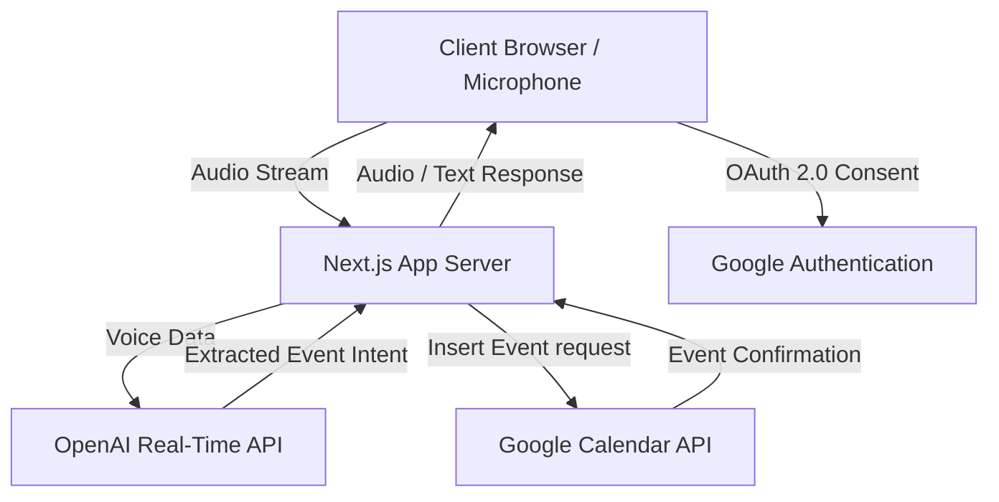

[](https://cerebrocal.vercel.app/)

# Cerebro Cal

Cerebro Cal is an advanced, real-time voice scheduling assistant that acts as a personal concierge. By operating completely through natural conversation, it removes the friction of manual data entry, traditional forms, and complex calendar management. Users can simply speak their scheduling intents, and Cerebro Cal seamlessly interfaces with Google Calendar to book, adjust, and confirm events instantly.

## Key Features

- **Real-Time Voice Interaction:** Leverage advanced audio processing to interact with the system naturally. No typing or manual form submission is required.
- **Native Google Calendar Integration:** Books directly to the user's primary calendar using secure OAuth 2.0.
- **Timezone-Aware Scheduling:** Automatically resolves timezones and scheduling conflicts, ensuring accurate bookings regardless of geographic location.
- **Instant Audio Confirmation:** Provides immediate feedback the moment an event is successfully secured on the calendar.
- **Zero-Friction Authentication:** A single Google sign-in grants the necessary permissions without requiring secondary credential management or third-party service accounts.

---

## System Architecture

Cerebrocal utilizes a modern tech stack to ensure low latency and high reliability when processing voice inputs and interfacing with external APIs.



### Flow Description

1. **Authentication:** The user authenticates via NextAuth using their Google account, passing a `calendar.events` scope.
2. **Audio Capture:** The client securely captures voice data and transmits it to the Next.js server.
3. **Intent Extraction:** The server interfaces with OpenAI's Realtime API to interpret the audio, identifying participants, dates, times, and context.
4. **Calendar Execution:** Next.js utilizes the authenticated session's access tokens to interact with the Google Calendar API, inserting the generated event.
5. **Confirmation:** The system relays a confirmation back to the client, providing auditory and visual reassurance.

---

## Showcase and Use Cases

Cerebrocal thrives in scenarios that demand speed and convenience. Below are examples of how the system parses natural language.

### Example 1: Standard Meeting
**User Input:** "Schedule a design sync with Sarah tomorrow at 2:00 PM."
**System Action:** Creates an event titled "Design Sync with Sarah" for the following day at 14:00 local time.
**System Response:** "I have added the Design Sync with Sarah to your calendar for tomorrow at 2:00 PM."

### Example 2: Finding Availability
**User Input:** "Do I have time for a 30-minute call this Thursday afternoon?"
**System Action:** Queries the Google Calendar for free slots on Thursday between 12:00 PM and 5:00 PM.
**System Response:** "You are completely free from 1:00 PM to 3:30 PM this Thursday. Would you like me to block out 30 minutes?"

### Example 3: Context-Rich Booking
**User Input:** "Block out an hour next Monday morning to review the quarterly financial reports."
**System Action:** Books a 60-minute session on the following Monday titled "Review Quarterly Financial Reports."
**System Response:** "Got it. One hour is blocked next Monday morning for your financial report review."

---

## Technology Stack

- **Framework:** Next.js 15 (App Router)
- **UI & Styling:** React 19, Tailwind CSS v4, Framer Motion
- **Authentication:** NextAuth.js (v5 Beta)
- **Integrations:** Google Calendar API, OpenAI REST/Realtime APIs
- **Date Utilities:** date-fns, date-fns-tz

---

## Getting Started

Follow the instructions below to set up Cerebrocal for local development.

### Prerequisites

- Node.js version 18 or higher
- A Google Cloud Console account
- An OpenAI API Key

### Google OAuth Setup

Cerebrocal requires a Google OAuth application to function. A service account is not needed.

1. Navigate to the Google Cloud Console and select **APIs & Services > Credentials**.
2. Create a new **OAuth 2.0 Client ID** as a **Web application**.
3. Add the following Authorized Redirect URIs:
   - Local: `http://localhost:3000/api/auth/callback/google`
   - Production: `https://your-domain.vercel.app/api/auth/callback/google`
4. Enable the **Google Calendar API** within the Google Cloud Library.
5. Note the generated **Client ID** and **Client Secret**.

### Installation

1. Clone the repository and install dependencies:

```bash
npm install
```

2. Create a `.env.local` file in the root directory based on `.env.example`:

```bash
cp .env.example .env.local
```

3. Populate the `.env.local` file with the following variables:

```env
OPENAI_API_KEY="your_openai_api_key_here"
AUTH_SECRET="your_generated_secret_here"
AUTH_URL="http://localhost:3000"
GOOGLE_CLIENT_ID="your_google_client_id_here"
GOOGLE_CLIENT_SECRET="your_google_client_secret_here"
```
*Note: Generate the `AUTH_SECRET` by running `openssl rand -base64 32` in your terminal.*

4. Start the development server:

```bash
npm run dev
```

Visit `http://localhost:3000` in your browser to access the application.

---

## Privacy and Security

Cerebrocal is built with privacy as a foundational principle.

- The application requests Google Calendar access exclusively to create and read events on the user's behalf during active sessions.
- No calendar data is persisted in a proprietary database.
- Audio data streamed to OpenAI is utilized solely for immediate intent translation and is not stored or utilized for model training by the application.
- Authentication paths are managed securely by NextAuth, ensuring tokens are properly encrypted and rotated.

---

## License

All rights reserved. Copyright 2026 Cerebro Cal.
